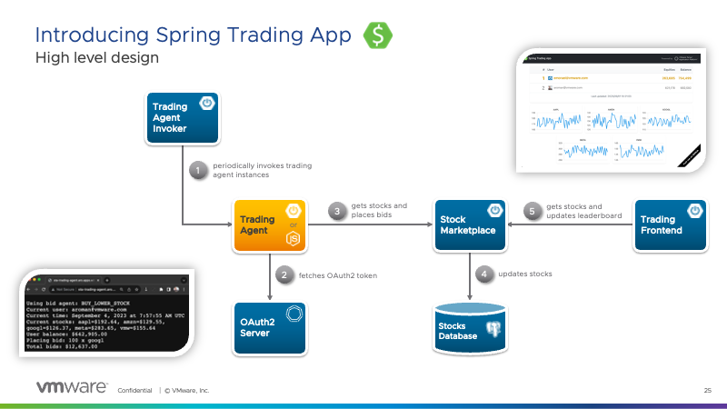

# Spring Trading App

Spring Trading App is a stock marketplace simulation.



It's a good way to learn about
[VMware Tanzu Application Platform](https://tanzu.vmware.com/application-platform),
a modern platform designed to simplify the Kubernetes developer experience.

> [!NOTE]
> This app is made of several components:
>
> - [marketplace](https://github.com/alexandreroman/sta-marketplace)
> - [frontend](https://github.com/alexandreroman/sta-frontend)
> - [invoker](https://github.com/alexandreroman/sta-invoker)
> - [accelerators](https://github.com/alexandreroman/sta-accelerators)

## How to deploy this app?

Please refer to each component for deployment instructions.

This repository includes a simple API Gateway using nginx.

> [!WARNING]
> The nginx container relies on the
> [Downward API](https://knative.dev/docs/serving/configuration/feature-flags/#kubernetes-downward-api)
> from Knative Serving:
> you need to enable this feature in your platform configuration.

In fact, the workload takes care of redirecting the inbound traffic to the
app components using the in-cluster Knative URL. This URL depends on the Kubernetes
namespace by default. When the Downward API is enabled in Knative Serving,
the nginx container can use this API to get the namespace dynamically.

If you cannot enable the Downward API on your Tanzu Application Platform installation
for some reason, you can still use this app: just edit the
[workload definition](config/workload.yaml) and set the namespace in the
environment variable `STA_NAMESPACE`.

Use this command to deploy this component:

```shell
tanzu apps workload apply -f config/workload.yaml
```
